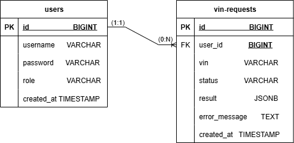
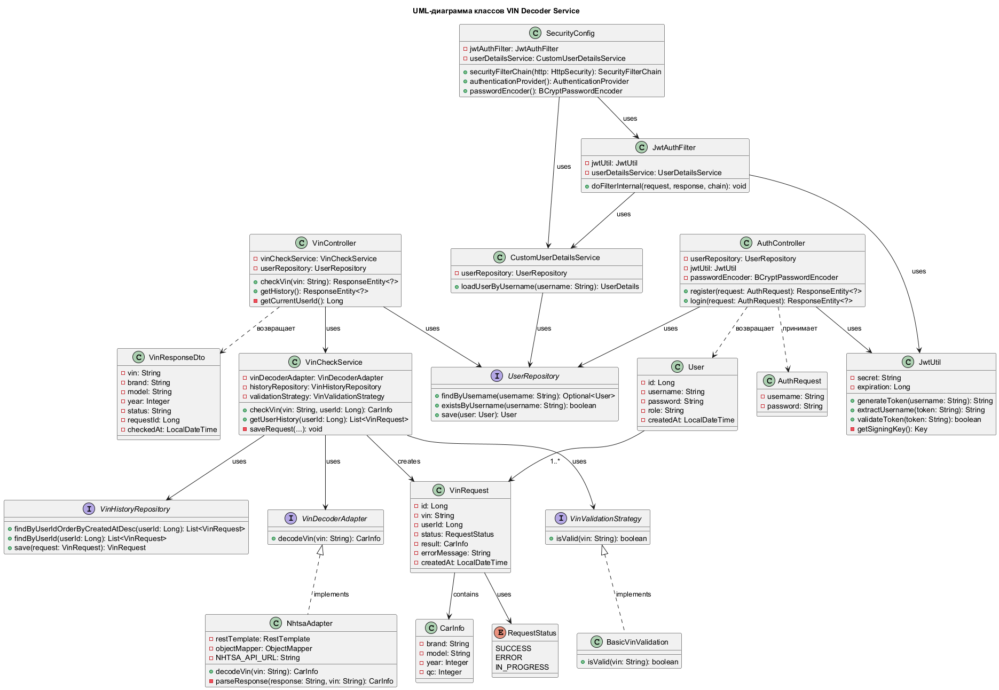
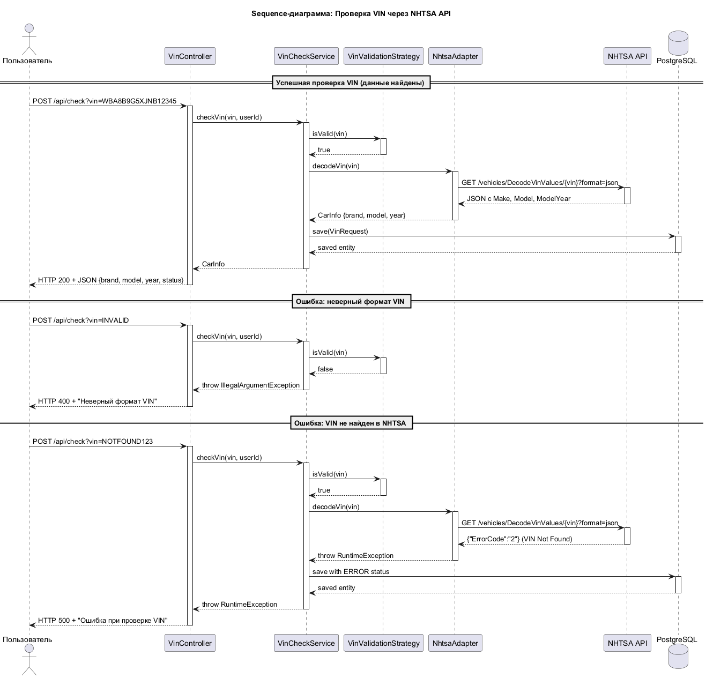
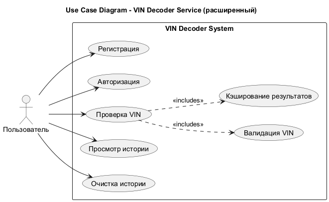

# VIN Decoder Service

## Описание
Сервис для расшифровки VIN-кодов автомобилей через NHTSA API (официальный API правительства США).

## Технологии
- Java 17 + Spring Boot 3.2
- Spring Security + JWT
- PostgreSQL + Hibernate
- Swagger/OpenAPI
- Spring Cache (кэширование)

## Функциональность
- Регистрация и аутентификация пользователей
- Проверка VIN через NHTSA API
- Кэширование результатов (повторные запросы мгновенны)
- История проверок в PostgreSQL
- Веб-интерфейс (HTML/CSS/JS)
- Swagger UI для тестирования API

## Запуск

### Требования
- Java 17
- PostgreSQL 14+
- Maven 3.8+

### Настройка базы данных

```sql
CREATE DATABASE vin_decoder;
CREATE USER vin_user WITH PASSWORD 'your_password';
GRANT ALL PRIVILEGES ON DATABASE vin_decoder TO vin_user;

### Конфигурация (application.properties)

```properties
spring.datasource.url=jdbc:postgresql://localhost:5432/vin_decoder
spring.datasource.username=postgres
spring.datasource.password=ghjuhju55

jwt.secret=yourSecretKeyForJWTGeneration2026
jwt.expiration=86400000

spring.cache.type=simple

###Быстрый запуск 

build-and-run.bat   # сборка + запуск
run.bat            # только запуск

###Веб-интерфейс
http://localhost:8080/index.html

###Swagger UI
http://localhost:8080/swagger-ui.html

## API Endpoints

| Метод | Эндпоинт | Описание |
|-------|----------|----------|
| POST | `/api/auth/register` | Регистрация нового пользователя |
| POST | `/api/auth/login` | Аутентификация и получение JWT токена |
| POST | `/api/check?vin={VIN}` | Проверка VIN-кода (требует токен) |
| GET | `/api/history` | Получение истории проверок (требует токен) |

## Диаграммы

| № | Название | Описание | Диаграмма |
|---|----------|----------|-----------|
| 1 | **ER-диаграмма** | Структура базы данных: таблицы `users` и `vin_requests`, связь один ко многим |  |
| 2 | **UML-диаграмма классов** | Архитектура приложения: контроллеры, сервисы, репозитории, паттерны Adapter и Strategy |  |
| 3 | **Sequence-диаграмма** | Последовательность вызовов при проверке VIN: Controller → Service → Adapter → NHTSA API → БД |  |
| 4 | **Use Case Diagram** | Варианты использования системы: регистрация, авторизация, проверка VIN, просмотр истории |  |